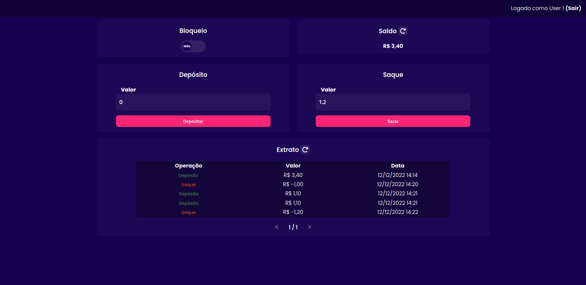
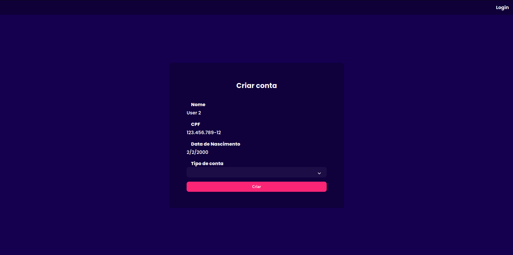
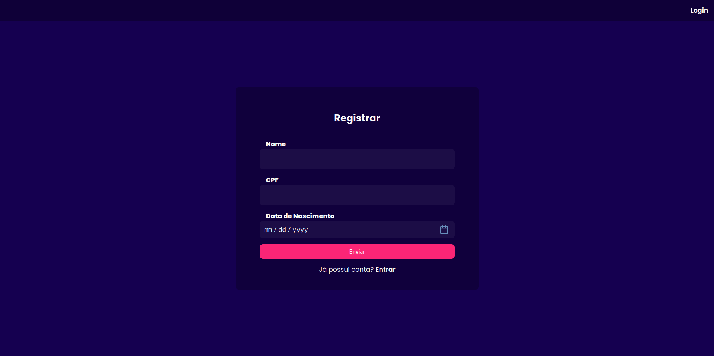

# desafio-bloxs
Desafio do processo seletivo de Full Stack Developer

## setup

Para rodar o projeto, basta seguir os comandos descritos abaixo na ordem em que aparecem.

### Baixando o projeto e fazendo setup da API
```bash
git clone https://github.com/vinimlo/desafio-bloxs.git
cd desafio-bloxs/api-bank
cp .env.example .env
make init
make install
```

### Primeira execução do banco
Entraremos na pasta do projeto e subiremos o banco
```bash
cd desafio-bloxs
docker-compose up
```

Em um novo terminal, vamos criar as tabelas e fazer um seed com 5 usuários. Depois, vamos executar a aplicação back-end.
```bash
cd desafio-bloxs/api-bank
make init
python create_db.py
flask seed-db
flask run
```

Agora é só acessar a aplicação em ```http://localhost:8080/```

## Dashboard



## Acessando conta do seed

Caso deseje acessar uma das contas do seed, é preciso criar a conta e vincular à pessoa já existente.

Para isso, pode acessar através de um destes 5 CPFs fictícios:

* 12345678911
* 12345678912
* 12345678913
* 12345678914
* 12345678915

Você será redirecionado à tela de criação de conta com as informações da pessoa em questão.



## Registrando-se

Além de poder usar das informações de uma pessoa já cadastrada, também é possível registrar-se.

Para isso, basta acessar a tela de registro e seguir os passos indicados.



